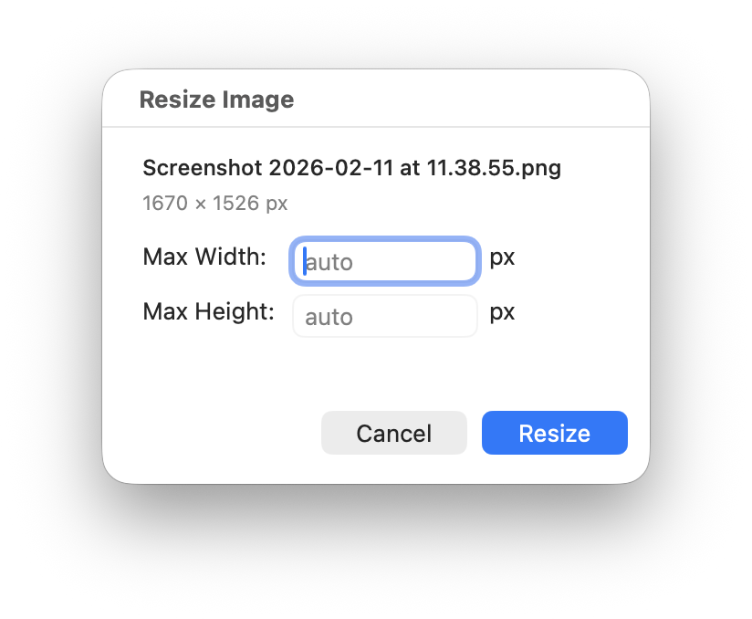

# Resize Image — macOS Finder Quick Action

A macOS Quick Action that lets you resize images directly from Finder's right-click menu. The resized image is saved alongside the original with dimensions in the filename (e.g., `photo_500x333.jpg`).

<p align="center">
  
</p>

## Features

- Right-click any image in Finder → Quick Actions → **Resize Image**
- Enter max width, max height, or both
- Proportional resizing (aspect ratio preserved)
- Original file is never modified
- Resized copy saved next to the original with dimensions in the filename
- Uses macOS built-in `sips` — no dependencies required
- Native two-field resize dialog (compiled from Swift at install time)
- Fully self-contained — the install script embeds everything into the workflow

## Requirements

- macOS (tested on Tahoe 26)
- Xcode Command Line Tools (`xcode-select --install`)

## Install

```bash
git clone https://github.com/hstaudacher/resize-image-quick-action.git
cd resize-image-quick-action
./install.sh
```

The install script compiles the dialog helper, bundles everything into a self-contained workflow, and registers it with macOS via Automator. The repo can be deleted after installation.

## Uninstall

```bash
rm -rf ~/Library/Services/Resize\ Image.workflow
```

## How It Works

1. You right-click an image and select **Quick Actions → Resize Image**
2. A dialog shows the filename, original dimensions, and two fields for max width/height
3. Enter one or both values — the other is calculated proportionally
4. The resized copy is saved as `originalname_WxH.extension`

## License

[MIT](LICENSE)
